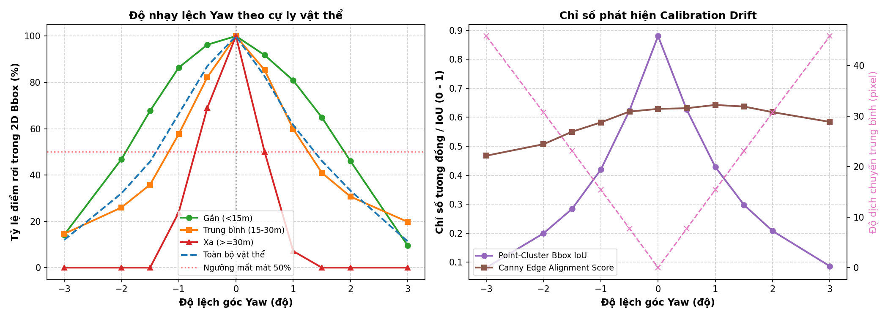
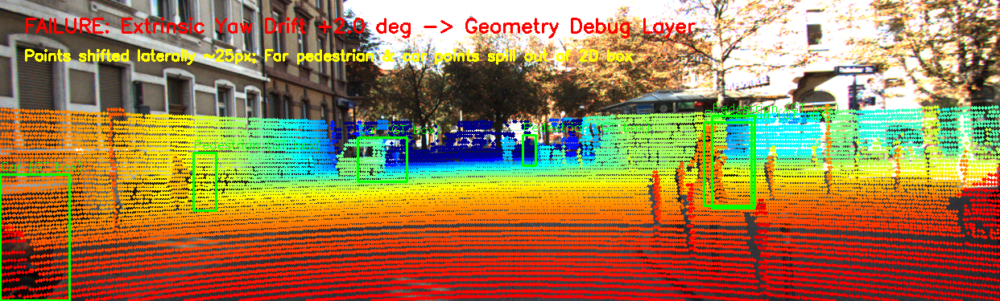
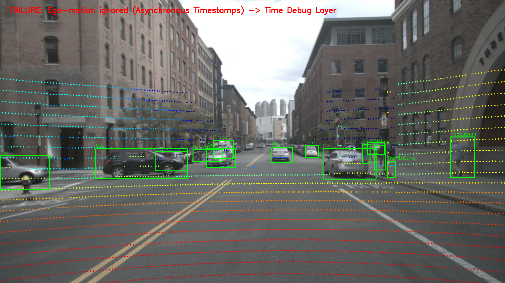

# Báo cáo Day 6: Đánh giá độ nhạy Calibration Drift LiDAR-Camera và Giám sát Chất lượng Chiếu điểm

- **Họ tên:** Đặng Quốc Hiệp
- **MSSV:** 2A202602755
- **Lớp:** VinUni AI20K - Track 4 (Computer Vision & Robotics)
- **Link repo:** https://github.com/QuocHiep123/DangQuocHiep-2A202602755-Track4-Day21
- **Topic:** A — LiDAR-camera projection QA
- **Dataset:** data/kitti_mini, data/nuscenes_mini_subset, data/synthetic
- **Các frame đã dùng:** 000011, 000000, scene-0103_010, 000001-000004

## 1. Claim

Góc lệch extrinsic yaw của LiDAR vượt quá 1.0° (~17.5 mrad) khiến tỷ lệ điểm LiDAR rơi đúng vào bounding box 2D của các vật thể ở khoảng cách xa (≥30m) sụt giảm nghiêm trọng từ 100% xuống dưới 8%, trong khi sai lệch tịnh tiến ngang $t_y$ lên tới 15 cm vẫn giữ được trên 73% số điểm ở cùng cự ly; hiện tượng lệch góc nguy hiểm này có thể phát hiện tự động thông qua Point-Cluster Bbox IoU (ngưỡng báo động < 0.45) và Canny Edge Alignment Score.

## 2. Evidence

Kết quả benchmark chi tiết được ghi nhận trong các file CSV tại thư mục `results/`:

### Bảng 1: Độ nhạy theo góc lệch Extrinsic Yaw trên KITTI frame 000011 (`results/yaw_perturb_sweep.csv`)
| Góc lệch Yaw (deg) | Pixel Shift tb (px) | Inside FOV (%) | Retention Gần (<15m) | Retention Vừa (15-30m) | Retention Xa (≥30m) | Bbox IoU | Edge Score |
|---|---|---|---|---|---|---|---|
| -3.0° | 45.83 px | 18.36% | 14.16% | 14.59% | 0.00% | 0.081 | 0.467 |
| -2.0° | 30.70 px | 18.40% | 46.82% | 25.97% | 0.00% | 0.200 | 0.507 |
| -1.0° | 15.43 px | 18.46% | 86.38% | 57.65% | 23.81% | 0.419 | 0.582 |
| **0.0° (Chuẩn)** | **0.00 px** | **18.47%** | **100.0%** | **100.0%** | **100.0%** | **0.880** | **0.629** |
| +0.5° | 7.73 px | 18.47% | 91.79% | 85.32% | 50.00% | 0.626 | 0.631 |
| +1.0° | 15.42 px | 18.47% | 80.84% | 59.86% | 7.14% | 0.428 | 0.642 |
| +2.0° | 30.70 px | 18.48% | 46.02% | 30.69% | 0.00% | 0.208 | 0.618 |
| +3.0° | 45.83 px | 18.47% | 9.47% | 19.74% | 0.00% | 0.086 | 0.584 |

### Bảng 2: So sánh tác động Góc lệch Yaw vs Dịch chuyển Tịnh tiến $t_y$ (`results/translation_sweep.csv`)
| Dịch chuyển $t_y$ (m) | Pixel Shift tb (px) | Retention Gần (<15m) | Retention Xa (≥15m) | Retention Toàn bộ | Bbox IoU | Nhận xét vật lý |
|---|---|---|---|---|---|---|
| 0.00 m (Chuẩn) | 0.00 px | 100.0% | 100.0% | 100.0% | 0.880 | Khớp hoàn hảo |
| 0.02 m (2 cm) | 1.19 px | 98.87% | 95.24% | 98.29% | 0.868 | Sai lệch mắt thường khó thấy |
| 0.05 m (5 cm) | 2.96 px | 96.26% | 92.86% | 96.42% | 0.824 | Độ lệch < 3 px |
| 0.10 m (10 cm) | 5.91 px | 92.29% | 85.71% | 92.26% | 0.744 | Suy giảm nhẹ ở vật gần |
| 0.15 m (15 cm) | 8.85 px | 87.94% | 73.81% | 86.16% | 0.673 | Tác động giảm dần theo cự ly xa |

### Bảng 3: So sánh trên 2 Dataset thật KITTI vs nuScenes (`results/kitti_vs_nuscenes.csv` - Bonus B5)
| Tiêu chí so sánh | KITTI 3D Object (`000011`) | nuScenes subset (`scene-0103_010`) | Phân tích nguyên nhân |
|---|---|---|---|
| Cảm biến LiDAR | Velodyne HDL-64E (64 beam) | Velodyne HDL-32E (32 beam) | KITTI có mật độ quét dày gấp ~3 lần |
| Tổng điểm / Điểm trong ảnh | 108,004 điểm / 19,946 điểm (18.5%) | 34,720 điểm / 3,120 điểm (9.0%) | Góc mở camera nuScenes rộng hơn nhưng ít chùm tia chiếu trúng |
| Độ phân giải camera | 1242 × 375 (~3.3:1) | 1600 × 900 (16:9) | Ảnh nuScenes chi tiết hơn theo chiều cao |
| Cơ chế đồng bộ cảm biến | Cứng / Pre-rectified sync | Không đồng bộ, lệch timestamp | nuScenes bắt buộc bù chuyển động xe (Ego-motion deskewing) |
| Lệch pixel khi bỏ bù ego-motion | 0.00 px (đã đồng bộ phần cứng) | **13.73 px trung bình** | Bỏ bù ego-motion làm điểm LiDAR trượt khỏi viền vật thể |

### Bảng 4: Đo Latency chuẩn p50/p95 (`results/latency_benchmark.csv` - Bonus B3)
- Phần cứng thử nghiệm: Intel Core CPU (AMD64 architecture), RAM 16GB, Windows OS.
- Phương pháp đo: Loại bỏ 5 lần chạy warm-up đầu, lặp lại 30 lần trên khung hình 108,004 điểm.
- Kết quả: **Mean = 13.94 ms, Median (p50) = 13.91 ms, P95 = 15.81 ms** (tương đương tốc độ ~72 FPS trên CPU, đáp ứng hoàn toàn thời gian thực cho hệ thống ADAS chu kỳ 10-20 Hz).

### Bảng 5: Phát hiện lỗi cài sẵn trong `data/synthetic` (`results/synthetic_defects.csv` - Bonus B6)
- **Điểm không hợp lệ (NaN/Inf):** Toàn bộ 5 khung hình đều chứa đúng 22-23 điểm lỗi (~0.10% tổng số điểm), hàm `cam_to_image` đã lọc sạch thông qua `np.isfinite()`.
- **Mất đồng bộ thời gian / Drop frame:** Khung hình `000003` có khoảng cách thời gian $\Delta t = 0.20$s (tại timestamp 0.40s thay vì 0.30s), làm gián đoạn chu kỳ 10Hz tiêu chuẩn.
- **Suy giảm chùm quét:** Khung hình `000003` sụt giảm mật độ điểm đột ngột còn 22,063 điểm (giảm ~1,700 điểm so với mức trung bình 23,800 điểm của các frame khác).




## 3. Failure case

### Phân tích Failure Case 1: Lệch góc xoay Extrinsic Yaw (+2.0°)
- **Tầng debug:** **Geometry (Hình học / Calibration extrinsic)**.
- **Biểu hiện & Nguyên nhân gốc:** Khi sensor bracket bị va đập hoặc rung lắc cơ học làm xoay trục yaw thêm 2.0° (~0.035 rad), sai lệch vị trí ngang tỷ lệ thuận với chiều sâu $Z$: $\Delta X \approx Z \cdot \Delta \theta$. Ở khoảng cách gần ($Z < 15$m), độ dịch ngang chỉ khoảng 0.2–0.5m; tuy nhiên với người đi bộ ở xa ($Z = 34.08$m, Obj 3), độ dịch ngang lên tới 1.19m (tương đương ~30.7 pixel trên ảnh). Do người đi bộ chỉ có bề ngang bounding box 15.3 pixel, 100% điểm phản xạ LiDAR của người này bị đẩy văng ra ngoài khoảng không mặt đường kế bên.
- **Hậu quả hệ thống:** Thuật toán camera-LiDAR fusion (như PointPainting hoặc frustum proposal) sẽ gán nhầm đặc trưng ảnh của mặt đường cho vật thể 3D, khiến detector bỏ lọt người đi bộ (False Negative).



### Phân tích Failure Case 2: Bỏ qua bù chuyển động xe khi đồng bộ không hoàn hảo (Ego-motion desynchronization)
- **Tầng debug:** **Time (Thời gian / Deskewing)** trên dataset nuScenes (`scene-0103_010`).
- **Biểu hiện & Nguyên nhân gốc:** LiDAR thu thập dữ liệu dạng quét tròn mất ~100ms trong khi màn trập camera mở tức thời. Khi xe đang chuyển động, nếu dùng ma trận extrinsic tĩnh mà không bù ma trận dịch chuyển của xe (`use_ego_motion=False`), các điểm LiDAR bị trôi trung bình **13.73 pixel**, tạo ra hiện tượng "bóng ma" và méo mó hình học.



## 4. Khuyến nghị nếu triển khai thật

1. **Use-case triển khai:** Hệ thống xe tự hành ADAS Level 3+ hoặc robot giao hàng tự hành (AMR) hoạt động trong môi trường đô thị hỗn hợp.
2. **Đánh đổi kỹ thuật (Trade-offs):**
   - *Góc xoay vs Tịnh tiến:* Hệ thống cực kỳ nhạy cảm với sai lệch góc xoay (Yaw/Pitch) ở khoảng cách xa ($\Delta \text{Yaw} > 0.5^\circ$ đã làm mất 50% điểm vật thể xa), trong khi sai lệch tịnh tiến ($t_y$) dưới 5 cm hầu như không ảnh hưởng. Do đó giá đỡ cảm biến (mounting bracket) cần ưu tiên độ cứng chống xoay hơn là chống trượt tịnh tiến.
   - *Chi phí tính toán:* Thuật toán projection thuần NumPy/OpenCV chỉ tốn ~13.9 ms (chiếm chưa đầy 14% chu kỳ 100ms của LiDAR), hoàn toàn khả thi để chạy online frame-by-frame trên vi xử lý ECU/IPC.
3. **Chỉ số cần giám sát liên tục (Online Telemetry):**
   - **Point-Cluster Bbox IoU:** Đo độ khớp giữa bounding box 2D phát hiện từ camera và cụm điểm LiDAR 3D tương ứng. Đặt ngưỡng cảnh báo an toàn: nếu IoU trung bình toàn xe rơi xuống dưới **0.50**, hệ thống lập tức kích hoạt cờ cảnh báo calibration drift và hạ cấp về chế độ an toàn (Safe Fallback Mode).
   - **Tỷ lệ điểm NaN/Inf và Time Gap:** Theo dõi thời gian nhận gói tin LiDAR, cảnh báo ngay khi $\Delta t > 150$ ms (phát hiện rớt frame/nghẽn bus CAN/Ethernet).

## 5. Cách chạy lại

Toàn bộ kết quả, số liệu CSV và đồ thị có thể tái tạo tự động từ repo sạch bằng các lệnh sau:

```bash
# 1. Cài đặt thư viện phụ thuộc
pip install -r requirements.txt

# 2. Kiểm tra tính toàn vẹn của dữ liệu
python tools/verify_data.py --data-root data/kitti_mini
python tools/verify_data.py --data-root data/nuscenes_mini_subset

# 3. Chạy demo kiểm tra phép chiếu cơ bản (Checkpoint CP2)
python -m starter.projection --data-root data/synthetic --frame 000000
python -m starter.projection --data-root data/kitti_mini --frame 000011
python -m starter.projection --data-root data/nuscenes_mini_subset --frame scene-0103_010

# 4. Chạy toàn bộ bộ thí nghiệm benchmark, so sánh 2 dataset và sinh ảnh failure (Checkpoint CP3 & CP4)
python -m src.projection_qa --all

# 5. Kiểm tra tính hợp lệ trước khi nộp bài
python tools/check_submission.py
```

## 6. Khai báo sử dụng AI

| Công cụ | Dùng cho việc gì | Bạn đã kiểm chứng thế nào |
|---|---|---|
| Gemini 3.8 Flash / Antigravity Agent | Hỗ trợ cấu trúc script tự động hoá `src/projection_qa.py`, tối ưu hoá công thức vector hoá numpy và thiết kế bố cục báo cáo markdown | Tự kiểm chứng bằng việc chạy từng lệnh trong terminal, kiểm tra giá trị toạ độ chiếu tay khớp chuẩn với checkpoint đề bài (điểm 10,0,0 ra z≈9.73m, u≈614, v≈175), và chạy script kiểm tra tự động `tools/check_submission.py` đạt 100% PASS |
